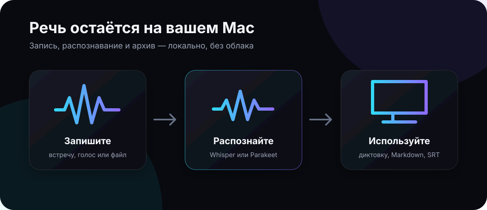

<p align="center">
  
</p>

# голос

Локальный распознаватель речи для macOS. Записывает встречи, расшифровывает
аудиофайлы и умеет диктовать текст в любое приложение. Ничего не уходит в сеть —
единственное сетевое обращение за всё время работы — скачивание модели.



## Что умеет

**Запись встреч.** Пишутся две независимые дорожки: ваш микрофон и весь звук
системы. Системный звук снимается через ScreenCaptureKit, поэтому одинаково
работают Zoom, Google Meet и Яндекс Телемост в браузере, звонки Telegram,
FaceTime — без отдельной поддержки каждого приложения. В расшифровке дорожки
подписаны как «Я» и «Собеседник».

**Определение звонков.** Приложение замечает, какая программа заняла микрофон,
и предлагает записать разговор; можно включить автостарт. Когда программа
микрофон отпустила, предлагает запись завершить — чтобы забытая запись не писала
часами. Уведомления настраиваются для каждой программы отдельно, в том числе
кнопкой прямо в уведомлении.

**Импорт файлов.** Перетащите mp3, m4a, wav, flac, mp4, mov — берётся звуковая
дорожка. Файл копируется внутрь контейнера, оригинал не трогается.

**Диктовка в любую программу.** Зажали `⌥Пробел` в почте, мессенджере или
редакторе кода, сказали, отпустили — текст вставился в поле ввода. Короткий тап
включает режим «зафиксировано»: можно говорить не удерживая клавиши. **Escape**
прерывает диктовку: запись останавливается, распознавание не запускается,
в приложение ничего не вставляется.

Следующую фразу можно начинать сразу, не дожидаясь, пока сойдёт плашка с
результатом, — и даже пока предыдущая ещё распознаётся. Её текст всё равно
вставится, когда досчитается.

Сочетание можно назначить любое, включая `⌘\`` и другие ⌘-комбинации.

**Два движка на выбор.** whisper.cpp и Parakeet TDT. Parakeet — другая
архитектура (транcдьюсер вместо encoder-decoder): заметно быстрее при близком
качестве, знает 25 европейских языков включая русский. Взамен не умеет ни
перевода, ни выбора языка — определяет его сам. Модели обоих движков лежат в
одном списке и переключаются одинаково.

**Модели для записей и для диктовки выбираются отдельно.** Для встреч имеет
смысл поставить самую точную, для диктовки — самую быструю. Переключатели есть
в трёх местах: в разделе «Модели», в настройках и прямо на экране диктовки.

**Управление моделями.** Двадцать моделей от 32 МБ до 3 ГБ: скачивание с
докачкой и паузой, удаление, размер на диске и оценка требуемой памяти.

**Монитор нагрузки.** Процессор по ядрам, видеоядро, память, температура, вклад
самого приложения — видно, во что обходится локальное распознавание.

## Установка

```bash
git clone https://github.com/bantqn/golos.git
cd golos
```

```bash
./build.sh install
```

Скрипт скачает и соберёт whisper.cpp, скомпилирует приложение, соберёт бандл с
иконкой, подпишет его и положит в `/Applications`.

Другие режимы:

```bash
./build.sh          # собрать в dist/
./build.sh run      # собрать и запустить
./build.sh clean    # удалить артефакты
```

Нужны Command Line Tools (`xcode-select --install`) и cmake (`brew install cmake`).
Полный Xcode не требуется.

### Быстрая проверка после сборки

```bash
./build.sh test            # модульные регрессионные тесты
GOLOS_UI_SNAPSHOT=/tmp/golos-ui ./dist/голос.app/Contents/MacOS/Golos
```

Вторая команда сохраняет PNG основных экранов и завершает приложение. Полный
чек-лист ручной и автоматической проверки — в [docs/TESTING.md](docs/TESTING.md).

## Оформление

По умолчанию приложение использует тёмную тему. В **Настройки → Внешний вид**
можно выбрать светлую тему или вариант «Как в системе»; выбор сохраняется в
общем `settings.json`. Там же меняются акцент, анимация фона и уменьшение
движения. Дизайн логотипа и альтернативные направления описаны в
[docs/BRAND.md](docs/BRAND.md).

Чек-лист первой публикации, подписи и notarization находится в
[docs/PUBLISHING.md](docs/PUBLISHING.md).

## Где лежат данные

Всё в одной папке:

```
~/Library/Application Support/Golos/
├── models/        скачанные модели
├── recordings/    аудио, по папке на запись
├── transcripts/   расшифровки в JSON
├── exports/       выгруженные txt/md/srt/vtt
├── logs/          журнал
├── settings.json
├── library.json
└── dictation.json
```

Приложение не пишет ничего за пределами этой папки — ни в UserDefaults, ни в
`~/Documents`, ни куда-либо ещё. Полное удаление: убрать `голос.app` и эту папку.

За пределами контейнера остаются только две системные вещи, на которые
приложение не влияет: записи о выданных разрешениях в базе TCC и системный кэш
скомпилированных GPU-шейдеров в `~/Library/Caches/com.apple.metal`.

## Разрешения

| Разрешение | Зачем | Без него |
|---|---|---|
| Микрофон | запись голоса, диктовка | нет своей дорожки и диктовки |
| Запись экрана | системный звук через ScreenCaptureKit | не записать собеседников |
| Универсальный доступ | вставка текста в чужие окна | текст только в буфер обмена |

Запись экрана нужна потому, что macOS отдаёт системный звук только через этот
API. Видео не пишется: поток настроен на кадр 2×2 пикселя, и кадры выбрасываются.

Приложение подписано ad-hoc подписью. После каждой пересборки macOS считает его
новым и просит выдать разрешения заново — это нормально для локальной сборки.

## Устройство

- **Движки** — whisper.cpp и Parakeet, оба слинкованы статически, ускорение
  через Metal. Снаружи они спрятаны за протоколом `SpeechEngine`, поэтому
  остальное приложение не знает, какая модель выбрана.
- **Модели** — ggml с Hugging Face: whisper из `ggerganov/whisper.cpp`,
  Parakeet из `ggml-org/parakeet-GGUF`.
- **Интерфейс** — SwiftUI, сборка через SwiftPM без Xcode-проекта.

Metal-ядра компилируются из исходника при первом запуске (около десяти секунд,
приложение показывает это в статусе), дальше берутся из системного кэша
мгновенно. Так сделано потому, что офлайн-компилятор `metal` входит только в
полный Xcode, а собирать приложение хотелось на голых Command Line Tools.

Экземпляров движка четыре: по одному на каждую пару «бэкенд × роль», где роли —
записи и диктовка. Роли разделены, чтобы короткая продиктованная фраза не ждала,
пока досчитается часовая встреча. Памяти это не стоит: неиспользуемые экземпляры
модель не держат.

Длинное аудио режется на окна с перекрытием в две секунды — ровный прогресс,
мгновенная отмена и предсказуемый расход памяти. Длина окна выбирается от
свободной памяти, в пределах от двух до десяти минут.

## Производительность

Замеры на M2 Max, модель `tiny-q5_1`, Metal:

```
11 секунд речи   → 0.48 с   (×23 к реальному времени)
1 час записи     → 57 с     (×62 к реальному времени)
```

Для встреч по умолчанию стоит `large-v3-turbo-q5_0` — 574 МБ, качество
large-модели при скорости, близкой к small. Для диктовки — `small-q5_1`.

## Память

Приложение исходит из того, что мак нужен пользователю не только для
распознавания, поэтому память отдаёт обратно, а не придерживает.

```
простой                      ≈ 150 МБ,  1.6% CPU
расшифровка часовой записи   ≈ 386 МБ пик  (tiny; с large-turbo-q5 добавьте размер модели)
через минуту после работы    ≈ 172 МБ  — модель выгружена, страницы возвращены системе
```

Как это устроено:

- **Аудио читается окнами.** `AudioWindowReader` держит в памяти одно окно и
  перекрытие с предыдущим, поэтому расход не зависит от длины записи: что
  двадцать минут, что четыре часа. Длина окна подбирается под свободную память.
- **Модель выгружается по простою** — через минуту по умолчанию, настраивается
  вплоть до «сразу». Плюс сразу после того, как очередь расшифровок опустела, и
  через полминуты после того, как окно потеряло фокус.
- **Запас для системы.** Перед загрузкой модели проверяется, останется ли
  свободным заданный запас (по умолчанию 4 ГБ). Если нет — модель не грузится, а
  приложение объясняет, чего не хватает, и предлагает вариант поменьше.
- **Ширина луча ограничивается по памяти.** Каждый декодер — это отдельный
  KV-кэш; на large-моделях луч в пять декодеров стоит гигабайты. Если памяти в
  обрез, луч сужается автоматически, а не уводит машину в своп. Заодно
  `best_of` держится равным единице: в параметрах whisper по умолчанию там
  пятёрка, то есть пять кэшей вместо одного.
- **Реакция на давление памяти.** Приложение подписано на системный сигнал о
  нехватке памяти: по нему выгружаются модели, сбрасываются кэши расшифровок и
  освобождённые страницы возвращаются системе.

Замерить самому:

```bash
GOLOS_BENCH=/путь/к/файлу.wav GOLOS_BENCH_RUNS=3 ./dist/голос.app/Contents/MacOS/Golos
```

Файл импортируется и расшифровывается указанное число раз, а в журнал раз в
секунду пишется текущий и пиковый расход памяти. Полезно, чтобы проверять, что
пик не растёт от прогона к прогону.

## Bluetooth-наушники и микрофон

Гарнитура, у которой включили микрофон, уходит из музыкального профиля (A2DP) в
режим разговора, и звук в ней становится узкополосным. Замерено по шагам на
OnePlus Buds Pro 3 — по частоте устройства вывода:

| Шаг | Частота выхода |
|---|---|
| до захвата | 44 100 Гц |
| создан `AVAudioEngine` | 44 100 Гц |
| **обращение к `engine.inputNode`** | **16 000 Гц** |
| переключение входа на встроенный микрофон | 16 000 Гц |
| движок запущен | 16 000 Гц |
| остановлен | 16 000 Гц |

Два вывода. Первый: профиль ломается **уже на обращении к `inputNode`** — до
выбора устройства и до старта, потому что `AVAudioEngine` привязывает вход к
устройству по умолчанию, а у подключённой гарнитуры это её микрофон. Переключить
устройство потом бесполезно, профиль уже сменился. Второй: обратно он
возвращается далеко не сразу — в замере оставался узкополосным и после остановки,
восстановившись сам примерно через полминуты.

Поэтому вход берётся не через `AVAudioEngine`, а через свой HAL AudioUnit
([InputTap.swift](Sources/Golos/Audio/InputTap.swift)), где устройство задаётся
**до** `AudioUnitInitialize` — так микрофон гарнитуры не открывается даже на миг.
Тот же замер с этим путём: 44 100 Гц от начала до конца.

Сверху — выбор устройства: пока включён переключатель «Не включать микрофон
Bluetooth-наушников» (по умолчанию), вместо микрофона гарнитуры берётся
встроенный. На распознавание речи это влияет мало, а музыку и голоса в наушниках
не портит. Исключение: если микрофон гарнитуры уже занят другой программой,
подмены нет — профиль всё равно переключён, и терять микрофон рядом с ртом
незачем.

Проверено на подключённых наушниках, собственным путём приложения:

| Проверка | Частота выхода | Что записано |
|---|---|---|
| Диктовка, подмена включена | 44 100 Гц всё время и после | встроенный микрофон, пик 0,068 |
| Диктовка, подмена выключена | падает до 16 000 Гц | микрофон гарнитуры, пик 0,012 |
| Полная запись (микрофон + звук системы) | 44 100 Гц всё время | обе дорожки на месте |

В простое приложение вход не занимает вовсе — проверено списком процессов
CoreAudio: у нашего процесса ни входа, ни выхода. Так что если наушники уходят в
режим разговора, пока приложение просто открыто, это делает кто-то другой;
в настройках это видно — там называется программа, занявшая микрофон.

Побочная польза: раз вход теперь встроенный, отключение наушников посреди записи
больше не рвёт дорожку микрофона.

## Как определяются звонки

Признак разговора — занятость микрофона. Раньше приложение знало только факт
«устройство кем-то занято» и догадывалось о программе по активному окну; отсюда
росли две беды. Висящий в фоне Telegram объявлялся источником разговора, которого
не было. И пока микрофон держали мы сами — записью или диктовкой, — отличить свой
микрофон от чужого было нельзя вовсе, поэтому детектор на это время просто
выключался.

С macOS 14.2 CoreAudio отдаёт список процессов, работающих со звуком, и у каждого
признак «пишет со входа» (`kAudioHardwarePropertyProcessObjectList`,
`kAudioProcessPropertyIsRunningInput`). Проверено замером: во время захвата в
списке оказывается ровно наш процесс, после остановки — никто. Свой процесс
исключается, поэтому:

- источник разговора известен точно, а не угадывается по активному окну;
- чужой микрофон видно и во время собственной записи — то есть видно, когда
  разговор закончился;
- диктовка в чужое окно больше не может быть принята за звонок в другой программе.

Вспомогательные процессы приводятся к своей программе (`com.google.Chrome.helper`
→ `com.google.Chrome`) — иначе звонок в браузере выглядел бы как разговор
безымянного процесса. Служебные демоны системы отфильтрованы по списку: замерено,
что при обычном захвате рядом с нами в списке оказывается `com.apple.CoreSpeech`,
и считать его разговором нельзя.

На системах старше 14.2 остаётся прежний путь: известен только факт занятости
устройства, программа угадывается по активному окну, а конец разговора не
определяется. Настройки об этом честно предупреждают.

### Когда разговор закончился

Программа отпустила микрофон — приложение по умолчанию **предлагает** завершить
запись (в окне и уведомлением), но не завершает само: человек мог продолжить
разговор в другой программе. В настройках можно выбрать «завершать сразу» или
«не реагировать».

Две защиты от ложного срабатывания:

1. Конец разговора объявляется не по первому пропуску в списке процессов, а после
   двух подряд.
2. Перед предложением выжидается пауза (по умолчанию 12 с, настраивается): при
   смене устройства или включении демонстрации экрана программы отпускают микрофон
   на секунду-другую. Если микрофон снова занят, запись просто продолжается.

Предложение появляется только для записи, начатой ради разговора. Дневную запись
и обычную запись с микрофона это не трогает: их начинали не из-за звонка.

Проверено на живом микрофоне двумя экземплярами приложения — один держит
микрофон, второй считает его посторонней программой:

| Проверка | Результат |
|---|---|
| Начало разговора | замечено, программа определена |
| Микрофон освободили, пока мы пишем сами | замечено — прежним способом было невозможно |
| Реакция «предлагать завершить» | предложение появилось через выдержку |
| Реакция «завершать сразу» | запись остановлена сама |
| Микрофон заняли снова во время выдержки | предложения нет, запись продолжается |
| «Не уведомлять об этой программе» | правило записано, автозапись не затронута |

## Разделение по голосам

Приложение сначала строит по звуку шкалу «кто когда говорит», и только потом
раскладывает по ней текст. Порядок именно такой, потому что обратный не работает:
Parakeet отдаёт девятиминутную запись **одной** репликой, и делить по репликам
там нечего. Шкала строится независимо от того, как модель распознавания нарезала
текст.

Как это считается:

1. Запись нарезается на окна по 1,5 с с шагом 0,75 с; для каждого окна считается
   вектор — три процентиля log-F0 плюс восемь усреднённых мел-признаков формы
   спектра. Тон весит втрое: без этого 48 из 49 признаков зависели от того, какие
   слова произнесены, и запись делилась по содержанию, а не по людям.
2. Векторы кластеризуются. Если число говорящих задано, оно берётся как есть;
   если нет — число подбирается по излому, а затем кластеры с близкой медианной
   высотой тона склеиваются обратно.
3. Метки сглаживаются медианным фильтром, короткие отрезки прилепляются к
   соседям, границы между отрезками сводятся в одну точку и подтягиваются к
   ближайшей тишине — люди сменяются в паузе, а не посреди слова.
4. Каждая реплика распознавания получает голос того отрезка, который её
   перекрывает. Если реплика растянулась на несколько отрезков, этот кусок
   аудио перечитывается и распознаётся заново по частям — по одной на голос.
5. Если реплики покрывают заметно меньше дорожки, чем она длится, их границам
   не верят вовсе и текст собирают заново целиком по шкале голосов. Это не
   перестраховка: у девятиминутного файла Parakeet вернул одну реплику с концом
   на 70-й секунде, хотя текст покрывал все девять минут. Куски всегда покрывают
   промежуток без щелей — короткий отрезок прилепляется к предыдущему, а не
   отбрасывается, иначе сказанное в нём просто исчезло бы из расшифровки.

Число говорящих можно задать заранее: при импорте файла приложение спрашивает,
сколько человек говорит и как их зовут (отключается в настройках). У готовой
записи это правится кнопкой в шапке — с пересчётом. Заданное число надёжнее
автоопределения, и именно оно спасает на похожих голосах.

Измерено на трёх записях:

| Запись | Задано | Результат |
|---|---|---|
| Два заметно разных голоса, 46 с | авто | 2 голоса, 4 отрезка — верно |
| Диалог с близкими голосами, 46 с | 2 | 6 отрезков, все границы попали в паузы |
| Тот же диалог | авто | не поделён: расхождение тона 0,25 ниже порога 0,30 |
| Один голос, 40 с | авто | не поделён — верно |
| Интервью, 9:24, Parakeet | 2 | 66 реплик, 2 роли, 1251 слово против 1226 без разделения |

Последняя строка — главная проверка: до перестроения по шкале Parakeet отдавал
это интервью одной репликой без ролей вообще. Слов стало не меньше, а чуть
больше — значит, перенарезка ничего не потеряла.

Порог 0,30 подобран замером: ниже 0,25 приложение начинало делить одного
человека на нескольких. Отличать настоящий диалог от такого ложного деления по
устройству меток во времени не получилось — казалось, что в диалоге блоки должны
быть длиннее, но у одного человека они такие же (6,8 и 7,4 окна против 10,0 у
настоящего диалога). Поэтому, когда голоса похожи по тону, приложение честно не
делит запись и предлагает указать число говорящих: в расшифровке появляется
подсказка с кнопкой.

Чего разделение не делает: не узнаёт людей между разными записями и не разбирает
одновременную речь двоих.

## Обработка речи языковой моделью

Распознавание даёт устную речь как есть — со «э-э», повторами и оговорками.
Дальше текст можно прогнать через языковую модель, и для разных программ нужен
разный редактор: в мессенджер — живая фраза, в терминал — команда, в почту —
вычитанный абзац.

**Провайдеры:** Ollama, LM Studio, любой совместимый с OpenAI (Ollama Cloud,
OpenRouter, свой сервер), OpenAI, Anthropic, Claude CLI. Ключи хранятся в связке
ключей macOS, а не в файле настроек. При любой ошибке вставляется исходный
распознанный текст — молча потерять фразу нельзя.

**Правило на программу.** Главная ось — программа, в которую диктуют: строка на
программу, и в ней выбор, что делать с текстом. Вариантов три: любой из
двенадцати пресетов, своя инструкция (пресет можно править прямо в строке) или
**«Без обработки»** — текст вставляется как распознан. Отдельная строка «Все
остальные программы» задаёт правило по умолчанию, и у неё тоже есть «Без
обработки».

Добавляя программу, приложение само подставляет подходящий пресет: Telegram —
«Сообщение в мессенджер», Терминал — «Команда для терминала», Xcode — «Задача
для агента», Почта — «Деловое письмо».

**Песочница** в настройках: берёте неряшливый пример продиктованного, правите
инструкцию и сразу видите, что вернула модель, с замером времени. Вслепую промпт
не настроить, а диктовать в чужое окно ради проверки — плохая идея.

Замеры на M2 Max, LM Studio с `qwen3-30b-a3b-2507` (MoE, 3B активных):

```
первый запрос после простоя   5–7 с    (сервер подгружает модель)
дальше                        0.9–1.7 с
```

Пресеты — не декорация: их формулировки пришлось править по результатам прогонов.
«Задача для агента» в первой версии выдумывала имена файлов, которых в речи не
было; «Деловое письмо» на неписьменном вводе вместо переписывания отвечало
канцелярским вопросом. Оба случая исправлены оговорками в инструкциях и
проверены повторно.

Выбор модели тут важнее, чем кажется. `qwen3:8b` в Ollama давал **18.4 с** на ту
же задачу: это рассуждающая модель, она сначала пишет `<think>` (я его вырезаю,
но время уходит). `llama-3.1-8b-instruct` отвечал так же быстро, как qwen3-MoE,
но портил смысл — «я говорю» превращалось в «вы говорите». Поэтому по умолчанию
стоит вариант Instruct без рассуждений.

## Диагностика внешнего вида

Терминал обычно не имеет доступа к записи экрана, поэтому в приложении есть два
режима, которые рисуют интерфейс в файл и завершаются:

```bash
GOLOS_HUD_SNAPSHOT=/tmp/hud.png  ./dist/голос.app/Contents/MacOS/Golos   # плашка диктовки
GOLOS_UI_SNAPSHOT=/tmp/screens   ./dist/голос.app/Contents/MacOS/Golos   # экраны приложения
```

Заготовки постобработки проверяются так — каждая прогоняется через настроенную
модель, результат пишется в журнал:

```bash
GOLOS_LLM_TEST="текст как продиктован" GOLOS_LLM_PRESET="clean,messenger,shell" \
  ./dist/голос.app/Contents/MacOS/Golos
```

Влияние на Bluetooth-наушники проверяется так — печатается частота устройства
вывода до, во время и после захвата: на слух это не проверишь, а падение с
44 100 до 16 000 Гц и есть переход в режим разговора.

```bash
GOLOS_MIC_TEST=5 ./dist/голос.app/Contents/MacOS/Golos              # с подменой
GOLOS_MIC_TEST=5 GOLOS_MIC_BT=1 ./dist/голос.app/Contents/MacOS/Golos   # без неё
GOLOS_REC_TEST=6 ./dist/голос.app/Contents/MacOS/Golos              # полный путь записи
```

`GOLOS_REC_TEST` пишет несколько секунд и докладывает, что оказалось в дорожках:
журнал скажет «запись начата» и при полной тишине, а размер файла — нет. Прогон
удаляет только свою запись и возвращает изменённые настройки.

Детектор разговоров проверяется двумя экземплярами приложения: первый наблюдает,
второй изображает чужую программу, занявшую микрофон. Иначе понадобился бы живой
звонок, а его в проверке не заведёшь.

```bash
GOLOS_CALL_WATCH=30 GOLOS_CALL_RECORD=1 ./dist/голос.app/Contents/MacOS/Golos &
sleep 6 && GOLOS_MIC_HOLD=8 ./dist/голос.app/Contents/MacOS/Golos
```

`GOLOS_CALL_END=finish|ask|ignore` задаёт реакцию на конец разговора,
`GOLOS_CALL_DELAY` — выдержку, `GOLOS_CALL_MUTE=1` заодно проверяет отключение
уведомлений для программы. Прогон возвращает изменённые настройки и удаляет
сделанную запись.

Разделение по голосам проверяется так — печатается шкала «кто когда говорит», а с
`GOLOS_DIAR_ASR` ещё и готовые реплики с ролями. Без этого проверять пришлось бы
на слух: границы отрезков нужны в секундах, а не на глаз.

```bash
GOLOS_DIAR=/путь/файл.wav GOLOS_DIAR_SPEAKERS=2 GOLOS_DIAR_ASR=1 \
  GOLOS_DIAR_NAMES="Аня,Борис" ./dist/голос.app/Contents/MacOS/Golos
```

Плашка рисуется во всех состояниях на ярко-малиновой подложке: на ней сразу
видно любой непрозрачный прямоугольник, если он вдруг появится вокруг.

У `ImageRenderer` есть ограничения, о которых стоит знать: он не умеет
`NavigationSplitView`, не рисует `TextField`, `Picker`, `Menu` и переключатели
(вместо них — жёлтые прямоугольники со знаком запрета), не материализует
содержимое `ScrollView` с ленивыми стеками, а главный экран записи не берёт
целиком. Поэтому отдельные карточки и диалоги рисуются в снимках сами по себе —
`card-finish`, `sheet-speakers`. То есть режим ловит грубые поломки вёрстки, но
не заменяет взгляд на живое окно.

## Интерфейс и нагрузка

Плывущий фон по умолчанию выключен: непрерывная анимация на всё окно занимает
около 13% процессора всё время, пока окно открыто, — и это не зависит от того,
как её оптимизировать. Включается в настройках («Живой фон»). Остальные анимации
— пульсация, бегущий блик, точки — появляются только во время работы и в простое
не стоят ничего.

## Структура проекта

```
Sources/Golos/
├── App/          точка входа, окружение, делегат
├── Audio/        микрофон (свой HAL AudioUnit), системный звук, WAV,
│                 ресемплинг, детектор звонков по процессам CoreAudio
├── ASR/          обёртка whisper, каталог и загрузчик моделей, очередь расшифровок
├── Dictation/    глобальный хоткей, вставка текста, плавающая панель
├── Store/        библиотека записей, расшифровки, экспорт
├── System/       монитор нагрузки
├── UI/           экраны и компоненты
└── Core/         контейнер, настройки, логи, форматирование
```

## Как устроены горячие клавиши

Глобальное сочетание регистрируется через Carbon Hot Keys, а не через
`CGEventTap`: тот потребовал бы разрешения «Мониторинг ввода» и видел бы каждое
нажатие в системе. Carbon-хоткей получает событие только для своей комбинации.

Escape перехватывается тем же способом, но **только на время диктовки** —
глобально занимать клавишу всей системы неправильно. Как только диктовка
закончилась или была отменена, Escape освобождается.

Окно записи сочетания перехватывает и `keyDown`, и `performKeyEquivalent`.
Второе обязательно: AppKit рассылает ⌘-комбинации как «эквиваленты клавиш», и
без этого перехвата `⌘\`` до записи просто не доходило.

## Известные ограничения

- Разделение по голосам не узнаёт людей между записями: «голос 1» в двух разных
  встречах — это, вообще говоря, разные люди. Имена задаются для каждой записи.
- Одновременную речь двоих разделение не разбирает: окно уходит к тому, чей
  голос громче.
- Модель `small.en-tdrz` умеет отмечать смену говорящего, но только на английском.
- Записать звук системы без разрешения на запись экрана нельзя — это ограничение
  macOS, а не приложения.
- Parakeet не умеет перевода и выбора языка. Если в настройках выбран язык или
  включён перевод, к моделям Parakeet это не применяется — интерфейс об этом
  предупреждает при выборе такой модели.
