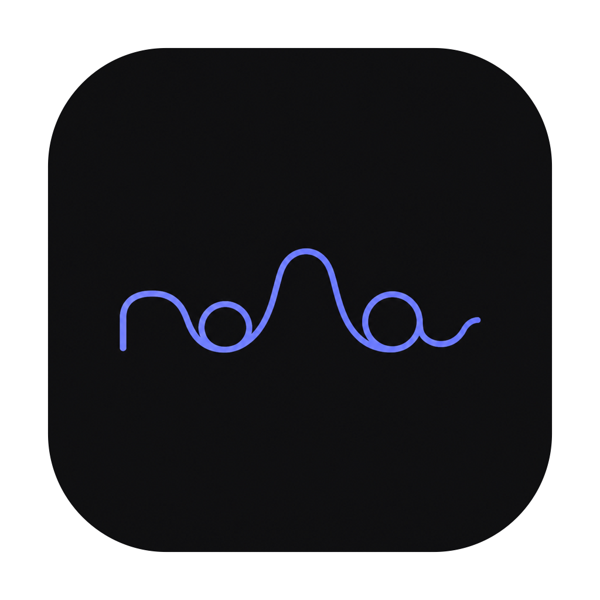
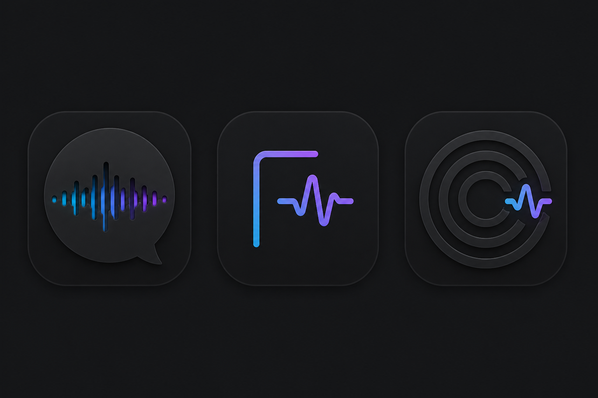

# визуальное направление «голос»

Рабочее направление — максимально простой знак из одной линии. Название
«голос» не читается напрямую: оно лишь угадывается в двух петлях и центральном
пике. Никаких отдельных букв, объёма, текстур и декоративных деталей.

## Варианты

Предыдущие направления оставлены ниже только как история поиска. Финальный знак
собирается во все размеры macOS скриптом `Scripts/make_icon.swift`.

Палитра: `#080A0F` (фон), `#171B27` (поверхность), `#32D8F4` (циан),
`#8E6CFF` (фиолетовый), `#F5F7FB` (основной текст).

Финальный мастер создан встроенным генератором изображений по запросу:
«максимально минимальный жест из одной линии; строчное слово голос почти
полностью растворено в ритме абстрактной волны». В сборке мастер кадрируется и
получает настоящий прозрачный alpha‑канал.
